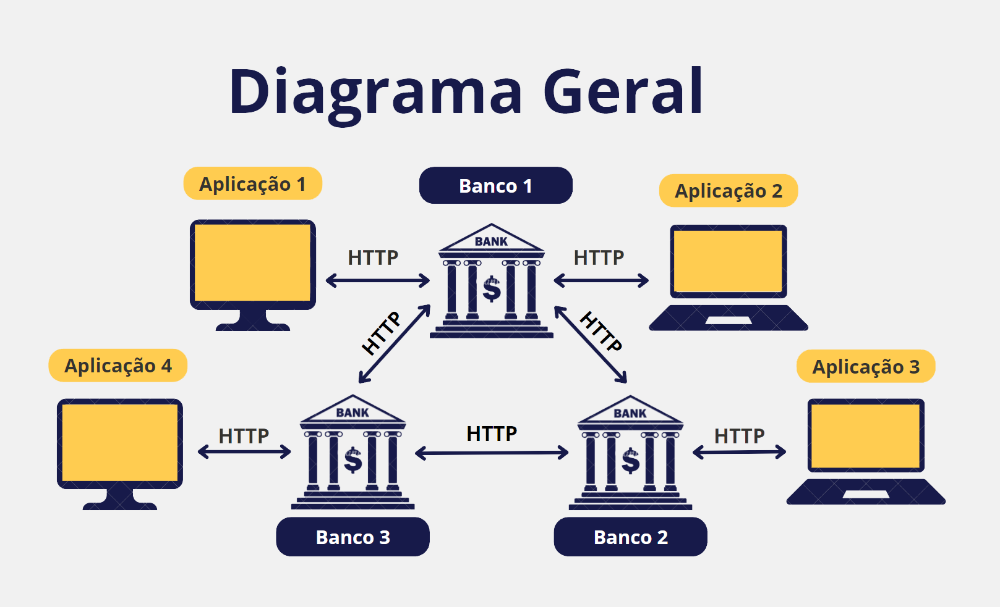
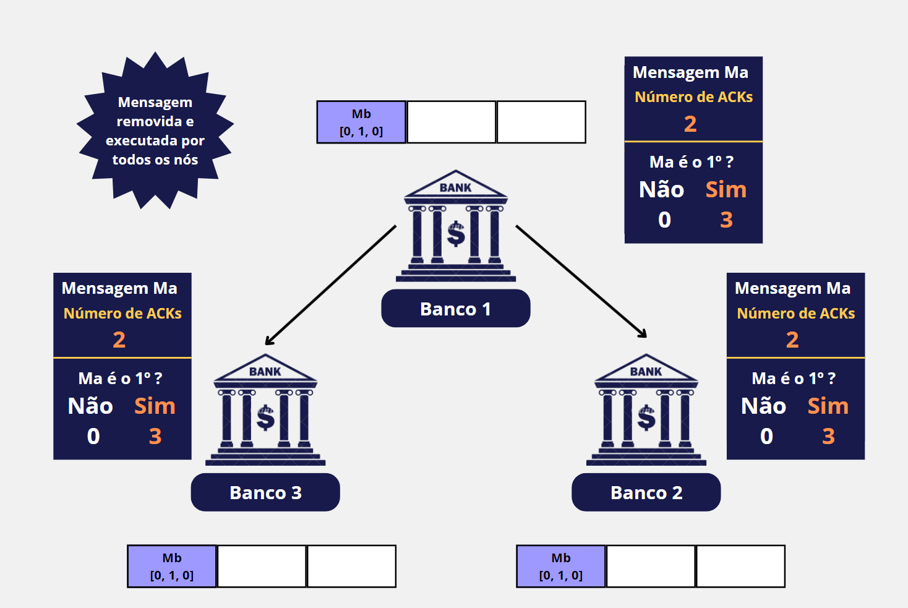

<p align="center">

</p>

<h1 align="center">NetBanking
</h1>

<h3 align="center">Projeto de Sistema Distribuído de Bancos Financeiros utilizando API REST</h3>


<div align="justify"> 
<div id="descrição"> 
<h2> Descrição do Projeto</h2>

O Pix é um sistema de pagamento instantâneo desenvolvido pelo Banco Central do Brasil, representa uma revolução do setor financeiro ao facilitar as transações bancárias de forma rápida, segura e acessível. Em resposta à crescente adesão a essa tecnologia, este projeto propõe o desenvolvimento de um sistema semelhante, adaptado para um país sem banco central, visando incluir clientes de diversos bancos em uma solução distribuída.

O sistema será implementado por meio de um consórcio bancário, permitindo a criação e o gerenciamento de contas para depósitos e transferências de valores entre diferentes bancos. Dessa forma, o projeto se estrutura em três componentes principais, cada um com requisitos específicos:

- **Cliente Bancário:** Oferece uma interface para pessoas físicas e jurídicas gerenciarem contas e transações de forma integrada. Isso inclui criar contas, realizar transações entre diferentes bancos ou internamente no mesmo banco, e lidar com transações sequenciais e concorrentes;

- **Servidor Bancário:** Centraliza e controla transações para garantir que o dinheiro não seja duplicado. Isso inclui verificar conexões, gerenciar erros e executar o sistema em containers Docker;

-  **Comunicação Interbancária:**  implementa uma API para troca segura e eficiente de dados entre os bancos, mantendo a integridade e confidencialidade das informações.

</div>
</div>


<h2> Autor <br></h2>
<uL>
  <li><a href="https://github.com/TAlmeida003">Thiago Neri dos Santos Almeida</a></li>

</ul>


<h1 align="center"> Sumário </h1>
<div id="sumario">
	<ul>
        <li><a href="#VisaoGeral"> Visão Geral do Sistema </a></li>
        <li><a href="#Software"> Softwares Utilizadas </a></li>
        <li><a href="#Funcionalidades"> Funcionalidades do sistema</a></li>
        <li><a href="#Ordenacao"> Algoritmo de Controle de Concorrência em Sistemas Distribuídos</a></li>
        <li><a href="#API"> API REST </a></li>
        <li><a href="#Organizacao"> Organização do Código Fonte </a></li>
        <li><a href="#Logica"> Lógica de Funcionamento do Sistema </a></li>
        <li><a href="#Testes"> Testes </a></li>
        <li><a href="#Conclusao"> Conclusão </a></li>
        <li><a href="#exe"> Execução do Projeto </a></li>
        <li><a href="#Referencias"> Referências </a></li>
	</ul>	
</div>


<div align="justify">
<div id="VisaoGeral">
<h2> Visão Geral do Sistema </h2>

O projeto desenvolvido é um sistema bancário distribuído, onde os bancos se comunicam internamente e com toda a rede por meio de um sistema ponto a ponto entre cada nó (banco). Para garantir que todos os nós operem em consenso e evitem a perda ou sobreposição de dados, o que poderia resultar em duplicidade de transações, o sistema utiliza o **algoritmo de Ordenação Total de *Multicast***. Este algoritmo será detalhado nos próximos tópicos.

Os usuários têm a flexibilidade de se conectar a qualquer um dos bancos para acessar as funcionalidades disponíveis no sistema, o que torna o sistema tolerante a falhas caso um banco específico esteja fora de operação. Abaixo, apresentamos um diagrama geral do sistema, ilustrando como os bancos se comunicam:

<p align="center">
  
</p>
<p align="center"><strong>Diagrama Geral do Sistema
</strong></p>

</div>
</div>


<div align="justify">
<div id="Software">
<h2> Softwares Utilizadas </h2>

Nesta seção, são apresentados os softwares utilizados durante o desenvolvimento do projeto.

<h3> Linguagem Python</h3>

A linguagem ***Python*** foi escolhida devido à sua facilidade de aprendizado e flexibilidade. 
Sua sintaxe limpa e legível permite a rápida prototipagem de ideias e o desenvolvimento ágil de aplicações. 
Além disso, *Python* é reconhecido pela sua vasta gama de bibliotecas e frameworks que facilitam o desenvolvimento 
em diversas áreas. É importante ressaltar que a versão utilizada foi a 3.12.2.

<h3> Biblioteca Flask</h3>

A biblioteca ***Flask*** é um módulo para construção de aplicações web em *Python*. Ela oferece flexibilidade 
para o desenvolvimento de APIs, permitindo a criação de endpoints RESTful e o gerenciamento de rotas HTTP.

<h3> Biblioteca Requests</h3>

A biblioteca ***Requests*** é uma ferramenta para fazer requisições HTTP em *Python*. Ela oferece uma 
interface que simplifica o processo de envio e recebimento de dados pela internet, tornando a 
comunicação com APIs mais eficiente.

<h3>Bibliotecas Asyncio e Aiohttp</h3>

As bibliotecas ***Asyncio*** e ***Aiohttp*** foram utilizadas para implementar funcionalidades assíncronas no projeto. O *Asyncio* permite a execução de código assíncrono, facilitando a realização de tarefas concorrentes, enquanto o *Aiohttp* é utilizado para realizar requisições HTTP de maneira assíncrona, melhorando a eficiência e o desempenho das operações de rede.

<h3> Docker</h3>

O ***Docker*** é uma plataforma de implantação e execução de aplicativos em contêineres. 
Um contêiner é uma unidade leve e portátil que inclui tudo o que um aplicativo precisa 
para ser executado de forma independente, como código, bibliotecas, dependências e configurações.
O Docker oferece uma plataforma consistente para desenvolver, testar e implantar aplicativos, 
garantindo que os ambientes de desenvolvimento e produção sejam consistentes e reproduzíveis.

<h3>IDE PyCharm</h3>

A IDE ***PyCharm*** é um ambiente de desenvolvimento integrado projetado especificamente para *Python*. O *PyCharm* oferece uma 
ampla gama de recursos para aumentar a produtividade dos desenvolvedores, incluindo realce de sintaxe avançado, 
completamento automático de código, depuração integrada e suporte para controle de versão. Além disso, o PyCharm possui
integração com o *Docker*, facilitando o desenvolvimento e a implantação de aplicativo *Python* em diversos ambientes.

<h3> Insomnia </h3>

O ***Insomnia*** é uma ferramenta usada para testar APIs e atuar como cliente REST, simplificando o desenvolvimento de APIs.
Com ele, os desenvolvedores podem criar, testar e depurar suas APIs de maneira eficiente, oferecendo suporte a 
diferentes métodos de requisição, autenticação, gerenciamento de variáveis e até mesmo a criação de fluxos de trabalho 
complexos.

</div>
</div>


<div align="justify">
<div id="Funcionalidades">
<h2> Funcionalidades do Sistema</h2>

Neste tópico, são apresentadas as funcionalidades disponíveis pelo sistema:

<h3>Criação de Usuários</h3>

Uma das funcionalidades do sistema é permitir que qualquer usuário tenha uma conta para acessar toda a rede de bancos. Ao criar uma conta de usuário em um dos bancos, é possível acessar qualquer um dos outros bancos. Para se registrar no sistema, é necessário informar o nome completo, o tipo de pessoa (física ou jurídica), o número de registro (CPF ou CNPJ), o nome de usuário e a senha de acesso. A imagem abaixo ilustra o processo de registro do usuário.

<p align="center">
  
</p>
<p align="center"><strong>Interface de registro de cliente</strong></p>

> **Observações:**
> Todos os dados pessoais são únicos; portanto, o sistema não permite novos registros se um usuário já estiver registrado com esses dados. Em caso de registros concorrentes (quando bancos tentam registrar usuários com os mesmos dados), apenas um será registrado.

<h3> Criação de Contas Bancárias</h3>

O sistema também possibilita a criação de contas bancárias para operações e movimentação de dinheiro. Um usuário pode ter várias contas bancárias, tanto em um único banco quanto nos outros bancos da rede. Para criar uma conta bancária, o usuário deve informar em qual banco será criada a conta, o tipo de conta (física, jurídica ou conjunta), e o tipo de PIX para aquela conta, que pode ser o número de registro (CPF ou CNPJ), o nome de usuário, o número da conta, ou um valor aleatório. Além disso, para criar uma conta é necessario disponibilizar um valor inicial maior ou igual a R$ 50,00. A imagem abaixo mostra o processo de registro no sistema.

<p align="center">
  
</p>
<p align="center"><strong>Interface para criar conta bancária
</strong></p>

> **Observações:** O número de conta criado é aleatório e individual dentro do banco. Em caso de criação concorrente (usuários pedindo para criar uma conta ao mesmo tempo), o sistema possui um gerenciamento interno em cada banco que permite que apenas um usuário crie uma conta por vez. Assim, se dois usuários tentarem criar contas ao mesmo tempo e os números de contas forem iguais, apenas uma será criada, e a outra será negada, sendo gerado um novo número de conta.

<h3>Operações Bancárias</h3>

O programa desenvolvido tem a capacidade de realizar operações bancárias por meio de pacotes (um pacote é um grupo de operações que são executadas de uma só vez), internamente e/ou externamente. Nesse sentido, são disponibilizadas três operações: depósito bancário, saque e transações via PIX. Ao criar um pacote, o usuário pode escolher quais bancos realizarão a operação, quais contas realizarão a ação e quais serão as operações realizadas.
A imagem abaixo ilustra o processo de criação de um pacote de operações bancárias.

<p align="center">
  
</p>
<p align="center"><strong>Interface para criar pacote de operações bancárias
</strong></p>

Por exemplo, o usuário A tem uma conta no banco 1 e no banco 2 e deseja realizar o seguinte pacote: depósito de R$ 50,00 e transação via PIX de R$ 150,00 na conta do banco 1, mas também deseja sacar R$ 450,00 no banco 2. Todas essas operações podem ser realizadas em um único pacote de uma só vez. Porém, caso ocorra um erro em uma das operações, o pacote é cancelado. A imagem abaixo mostra um pacote montado.

<p align="center">
  
</p>
<p align="center"><strong>Interface para mostrar o pacote de operações bancárias pronto
</strong></p>

> **Observações:** Todas as operações realizadas são enviadas para todos os bancos, permitindo que todos saibam quais operações estão ocorrendo na rede.
As operações são executadas na mesma ordem entre os nós, garantindo que transações concorrentes entre bancos sejam tratadas.
O sistema possui um gerenciamento interno onde apenas uma operação pode ser enviada por vez por cada banco, evitando concorrência interna.

<h3>Extrato Bancário</h3>
 
Por fim, o banco oferece a possibilidade de acessar os dados de cada conta, permitindo visualizar os dados do(s) responsável(is) pela conta, o saldo atual e um extrato bancário com o histórico de todas as operações realizadas na conta. A imagem abaixo ilustra essa funcionalidade.

<p align="center">
  
</p>
<p align="center"><strong>Interface para mostrar o extrato bancário de uma conta Individual
</strong></p>

<p align="center">
  
</p>
<p align="center"><strong>Inferface para mostrar o extrato bancário de uma conta conjunta
</strong></p>

</div>
</div>


<div align="justify">
<div id="Ordenacao">
<h2>Algoritmo de Controle de Concorrência em Sistemas Distribuídos</h2>

Em sistemas distribuídos, a ordenação total de mensagens é fundamental para garantir que todas as operações bancárias e registros de usuários sejam processados na mesma ordem em todos os nós da rede. Enquanto abordagens sem ordenação podem resultar em mensagens sendo processadas em ordens diferentes nos nós, a ordenação total assegura consistência e integridade dos dados.

<h3>Relógio Vetorial</h3>

Antes de discutir o algoritmo de controle de concorrência, é crucial entender o relógio vetorial. Este mecanismo de *timestamp* é usado para capturar a ordem causal de eventos entre diferentes processos em um sistema distribuído. Cada processo mantém um vetor de contadores, onde cada entrada representa o número de eventos observados por aquele processo.

Ao enviar uma mensagem, um processo inclui uma cópia de seu vetor de relógios. Ao receber uma mensagem, um processo atualiza seu vetor combinando-o com o vetor recebido, garantindo uma visão consistente da ordem de eventos entre todos os processos. As próximas imagens ilustram o funcionamento do relógio vetorial e seu uso na ordenação de mensagens.

<p align="center">
  
</p>
<p align="center"><strong>Exemplo de rélogio vetorial com 3 processos e 4 eventos
</strong></p>

<p align="center">
  
</p>
<p align="center"><strong>Ordem de execução de mensagens
com base no relógio vetorial para os 3 processos e 4 eventos
</strong></p>


Em caso de eventos concorrentes, onde dois eventos ocorrem simultaneamente em diferentes processos, o relógio vetorial garante que a ordem dos eventos seja consistente em todos os processos. No entanto, apenas com o relógio vetorial, não é possível determinar qual evento ocorreu primeiro. Quando ocorre um conflito, onde dois relógios são simultaneamente maiores e menores, o **ID** do processo é utilizado para decidir a ordem dos eventos. As imagens a seguir ilustram esse cenário.

<p align="center">
  
</p>
<p align="center"><strong>Cenário de eventos concorrentes
</strong></p>

<p align="center">
  
</p>
<p align="center"><strong>Ordem de execução de mensagens com 
base no ID do processo para eventos concorrentes
</strong></p>


<h3>Ordenação Total com Multicast usando Relógio Vetorial</h3>

O **algoritmo de ordenação total com *multicast*** pode ser dividido em vários passos, segue uma explicação simplificada do processo:

1.	**Envio da Mensagem:** Um nó envia uma mensagem para todos os nós da rede, anexando seu vetor de relógios atual;

<p align="center">
  
</p>
<p align="center"><strong>Dois eventos concorrentes em diferentes processos com as mesagens "Ma" e "Mb"
</strong></p>

2.  **Recebimento da Mensagem:** Ao receber a mensagem, cada nó a coloca em um *buffer* interno ordenado pelo relógio vetorial associado. Isso garante que todas as mensagens sejam ordenadas de acordo com o relógio vetorial;

<p align="center">
  
</p>
<p align="center"><strong>Distribuição de mensagens em buffers internos ordenados por relógio vetorial em diferentes processos
</strong></p>

3.	**Confirmação (ACK):** Cada nó envia um ACK para todos os outros nós indicando que recebeu a mensagem;

<p align="center">
  
</p>
<p align="center"><strong>Confirmação de recebimento de mensagens com ACKs
</strong></p>

4.	**Verificação e Execução:**

    -	Após receber ACKs de todos os nós, o nó remetente verifica se a mensagem no topo de seu *buffer* é a próxima a ser processada. 
Em seguida, consulta todos os outros nós para verificar se a mensagem no topo de seus *buffers* é a mesma;

    <p align="center">
    
    </p>
    <p align="center"><strong>Verificação de mensagens no topo do buffer em todos os nós
    </strong></p>

    -	Se todas as réplicas concordarem que a mensagem no topo do *buffer* é a próxima na ordem global, o nós a removem do *buffer* e a executa;
  
    <p align="center">
    
    </p>
    <p align="center"><strong>Execução de mensagens no topo do buffer
    </strong></p>

    -	Caso contrário, o nó aguarda até que todas as mensagens anteriores no *buffer* tenham sido processadas.

    <p align="center">
    
    </p>
    <p align="center"><strong>Aguardando a execução de mensagens anteriores no buffer em todos os nós e reiniciando a verificação.
</strong></p>

Este algoritmo pode introduzir latência devido ao número de mensagens necessárias para confirmação e verificação, mas garante que todas as mensagens sejam entregues e processadas na ordem correta. No contexto de sistemas distribuídos como o descrito no projeto, onde operações são agrupadas em pacotes, este método proporciona uma otimização eficiente já que todos os nós já possui a mensagem e garante a consistência e a ordem das operações em todos os nós da rede.

</div>
</div>


<div align="justify">
<div id="API">
<h2> API REST </h2>

A comunicação entre a aplicação cliente e o serviço bancário, assim como entre os bancos, é realizada através de uma API
REST utilizando o protocolo HTTP. A API foi desenvolvida com base no *framework* **Flask**, conhecido por facilitar a criação
de *endpoints* RESTful e o gerenciamento de rotas HTTP. A seguir, são destacados os principais *endpoints* disponíveis na 
API, divididos entre o uso pelos bancos e pelos clientes:

<h3>URL Principal</h3>

A URL principal da API é: http://localhost:3050

> **Nota Importante:** As rotas estão configuradas para serem acessadas localmente como exemplo. Os IPs e portas 
> mencionados são fictícios e devem ser ajustados conforme a configuração específica do ambiente de implementação.

<h3>Códigos de Status HTTP</h3>

- **200:** Indica que a requisição foi executada com sucesso.
- **400:** Alerta sobre falhas ou erros na execução do pedido.
- **404:** Indica que o dispositivo ou endpoint solicitado não foi encontrado.
- **500:** Significa que ocorreu um erro interno no servidor.

<h3>Endpoints para o Bancos</h3>

Endpoints para a ordenação total de mensagens e transações entre os bancos :

<h4>Receber Mensagem:</h4>

- **Descrição:** Recebe uma mensagem de um banco específico, adicionando-a ao buffer de mensagens.

- **Método:** POST

- **Rota:** `/receive-message`

- **Requisitos:** O corpo da requisição deve conter as informações da mensagem a ser recebida.

- **Exemplo de Corpo da Requisição:**
```json
{
    "sender": 0,  
    "timestamp": [5, 9, 1],
    "type_msg": "REGISTER",
    "id": "EV192.168.0.1-1584",
    "msg": {"mensagem" : "mensagem"}
}
```

> O campo `sender` indica o número do banco que enviou a mensagem, `timestamp` é o vetor de relógio vetorial associado à mensagem, `type_msg` é o tipo da mensagem, `id` é o identificador único da mensagem e `msg` é o conteúdo da mensagem.

<h4>Receber ACK:</h4>

- **Descrição:** Recebe um ACK de um banco específico, confirmando a recepção da mensagem.

- **Método:** POST

- **Rota:** `/receiver_ack/<string:event_id>`

- **Requisitos:** O parâmetro `event_id` deve conter o identificador único da mensagem que está sendo confirmada.

<h4>Iniciar Verificação de se é o Primeiro da Fila:</h4>

- **Descrição:** Inicia a verificação de se o banco é o primeiro da fila para processar a mensagem.

- **Método:** POST

- **Rota:** `/init_check_queue/<string:event_id>`

- **Requisitos:** O parâmetro `event_id` deve conter o identificador único da mensagem que está sendo confirmada e o corpo da mensagem  a ser recebida.

- **Exemplo de Corpo da Requisição:**
```json
{
    "code": false,
    "descript": "Falha na operação: CPF já cadastrado"
}
```

> O campo `code` indica se aquele pacote pode 
ser executado por todos os nós e `descript`é o tipo de problema que ocorreu caso não possa ser executado.

<h4>Receber Se é o Primeiro da Fila:</h4>

- **Descrição:** Recebe a confirmação de que o banco é o primeiro da fila para processar a mensagem ou não.

- **Método:** POST

- **Rota:** `/receiver_one_queue/<string:event_id>`

- **Requisitos:** O parâmetro `event_id` deve conter o identificador único da mensagem que está sendo confirmada e o corpo da mensagem  a ser recebida.

- **Exemplo de Corpo da Requisição:**
```json
{
    "code": true,
    "descript": "",
    "msg": "ONE_QUEUE"
}
```
> O campo `code` indica se aquele pacote pode ser executado por todos os nós, `descript` é o tipo de problema que ocorreu caso não possa ser executado e `msg` é o  primeiro da fila para processar a mensagem.


<h3>Endpoints para Funcionalidades do Banco</h3>

Endpoints para as funcionalidades do banco:

<h4>Registrar Cliente</h4>

- **Descrição:** Registra um cliente no banco.

- **Método:** POST

- **Rota:** `/register-customer`

- **Requisitos:** O corpo da requisição deve conter as informações do cliente a ser registrado.

- **Exemplo de Corpo da Requisição:**
```json
{
    "name": "Pedro Silva", 
    "num_cadastro": "123.123.123-00",
    "user_name": "pedrinho234",
    "password": "12345678",
    "type_person": "PF"
}
```

> O campo `name` é o nome completo do cliente, `num_cadastro` é o número de registro (CPF ou CNPJ), `user_name` é o nome de usuário e `password` é a senha de acesso.

- **Resposta:** Retorna os status da operação, confamando ou não o registro do cliente.

- **Exemplo de Resposta:**
```json
{
    "descript": "Cliente pedrinho234 criado com sucesso"
}
```

<h4>Login</h4>

- **Descrição:** Realiza o login de um cliente no banco.

- **Método:** GET

- **Rota:** `/login`

- **Requisitos:** O parâmetro `user_name` deve conter o nome de usuário e o parâmetro `password` deve conter a senha de acesso.

- **Exemplo de Requisição:**
```json
{
    "user_name": "renata332",
    "password": "12345678"
}
```

- **Resposta:** retorna os dados do cliente logado ou uma mensagem de erro.

- **Exemplo de Resposta:**
```json
{
    "data": {
        "accounts": {
            "0":[
                [906647, 50.0, "0:123.123.123-01"]
            ],
            "1":[
            ],
            "2":[
                [906587, 5250.0, "2:123.123.123-01"],
                [966587, 7550.0, "2:renata332"]
            ]
        },
        "name": "Renata Silva",
        "num_cadastro": "123.123.123-01",
        "type_person": "PF",
        "user_name": "renata332"
    },
    "descript": "Logado com sucesso"
}

```
>O campo `data` contém as informações do cliente logado, incluindo as contas bancárias associadas, o campo `descript` indica se o login foi bem-sucedido ou não.


<h4>Criar Conta</h4>

- **Descrição:** Cria uma conta bancária para um cliente.

- **Método:** POST

- **Rota:** `/accounts_user/<string:user_name> `

- **Requisitos:** O parâmetro `user_name` deve conter o nome de usuário e o corpo da requisição deve conter as informações da conta a ser criada.

- **Exemplo de Corpo da Requisição:**
```json
{
    "user_name": "karen123",
    "password": "12345678",
    "type_account": "PF",
    "pix_type": "CPF", 
    "users": [],
    "value_init": 250.0
    }
```

- **Resposta:** Retorna os status da operação, confirmando ou não a criação da conta.

- **Exemplo de Resposta:**
```json
{
    "descript": "Conta criada com sucesso"
}
```

<h4>Acessar conta</h4>

- **Descrição:** Acessa uma conta bancária para um cliente.

- **Método:** GET

- **Rota:** `/get_account/<string:num_account>`

- **Requisitos:** O parâmetro `num_account` deve conter o número da conta a ser acessada.

- **Resposta:** Retorna os dados da conta acessada ou uma mensagem de erro.

- **Exemplo de Resposta:**
```json
{
    "data": {
        "num_account":906647,
        "balance":530.0,
        "name": "Renata Silva",
        "kay_pix": "123.123.123-01",
        "type_account": "CONJUNTA",
        "user_names": ["renata332", "matheus123"],
        "transactions": [
            {
                "type": "DEPOSIT",
                "app_balance": 530.0,
                "value": 50.0,
                "date": "2022-10-10",
                "made_by": "renata332",
                "bank_sender": 0
            }
        ]
    },
    "descript": "Conta acessada com sucesso"
}
```

<h4>Operações Bancárias</h4>

- **Descrição:** Realiza operações bancárias para um cliente.

- **Método:** POST

- **Rota:** `/operations`

- **Requisitos:** O corpo da requisição deve conter as informações da operação a ser realizada.

- **Exemplo de Corpo da Requisição:**
```json
{
    "0": {
        "2432433": {
            "package": [
                {"type": "TRANSFER", "value": 500.0, "sender": 2432433, "pix": "1:thiago003"},
                {"type": "TRANSFER", "value": 100.0, "sender": 2432433, "pix": "0:juninho234"},
                {"type": "TRANSFER", "value": 450.0, "sender": 2432433, "pix": "2:mara21"}
            ]
        }
    },
    "1": {
        "2432430": {
            "package": [
                {"type": "DEPOSIT", "value": 50.0, "sender": 2432433},
                {"type": "DEPOSIT", "value": 100.0, "sender": 2432433},
                {"type": "DEPOSIT", "value": 450.0, "sender": 2432433}
            ]
        }
    },
    "2": {
        "2432431": {
            "package": [
                {"type": "WITHDRAW", "value": 5690.0, "sender": 2432433}
            ]
        }
    }
}
```

> Corpo do pacote de operações a serem realizadas. A primeira chave é o número do banco, a segunda chave é o número de conta e o campo `package` contém as operações a serem realizadas. Cada operação possui o tipo da operação, o valor, o remetente e/ou o PIX de destino.

>  As operações do pacote só podem ser **DEPOSIT**, **WITHDRAW** ou **TRANSFER**. 
- **Resposta:** Retorna os status da operação, confirmando ou não a execução do pacote.

- **Exemplo de Resposta:**
```json
{
    "descript": "Pacote de operações executado com sucesso"
}
```

</div>
</div>


<div align="justify">
<div id="Organizacao">
<h2> Organização do Código Fonte </h2>

O código fonte do projeto está organizado em diferentes módulos, cada um responsável por uma parte específica do sistema.
De maneira geral, a arquitetura se divide em duas partes principais: a aplicação cliente e o serviço bancário. A seguir,
são apresentadas essas estruturas:

<h3>Aplicação Cliente</h3>

A aplicação cliente é responsável por interagir com o usuário, permitindo o acesso às funcionalidades do sistema. 
No código fonte, ela está localizada no diretório `src/view` e é composta por quatro subdiretórios:

- **`enums`:** Onde são armazenadas algumas constantes;

- **`options`:** Onde está a lógica de navegação dos menus e telas;

- **`screens`:** Onde estão as telas do sistema;

- **`utils`:** Onde estão as funções auxiliares, como funções de impressão, validação e as requisições HTTP.

A imagem abaixo ilustra a estrutura da aplicação cliente:

<p align="center">
    
    </p>
    <p align="center"><strong>Estrutura da aplicação cliente
</strong></p>


<h3>Serviço Bancário</h3>

O serviço bancário é responsável por gerenciar as operações bancárias, a comunicação entre os bancos e a ordenação total de mensagens entre os nós. No código fonte, ele está localizado no diretório `src/app` e é composto por seis subdiretórios:

- **`API`**: Onde estão as rotas da API REST, utilizadas tanto pelos bancos quanto pelos clientes.

- **`Bank`**: Onde estão as classes e funções responsáveis por gerenciar as operações bancárias e o gerenciamento dos dados dos clientes e contas bancárias. O módulo conta com os arquivos `Account.py` (dados das contas), `Bank.py` (lógica do banco e armazenamento de dados) e `User.py` (dados dos usuários).
 
- **`enums`**: Onde estão armazenadas algumas constantes.
 
- **`Exception`**: Onde estão as classes de exceção personalizadas.
 
- **`Node`**: Onde estão as classes e funções responsáveis por realizar a ordenação total de mensagens entre os nós e a verificação de falhas dos nós. O módulo conta com os arquivos `Node.py` (lógica da ordenação total de mensagens), `Event.py` (dados das mensagens) e `VectorClock.py` (lógica do relógio vetorial).
 
- **`utils`**: Onde estão as funções auxiliares, como funções de validação e as requisições HTTP.

A imagem abaixo ilustra a estrutura do serviço bancário:

<p align="center">
    
    </p>
    <p align="center"><strong>Estrutura da aplicação cliente
</strong></p>

</div>
</div>


<div align="justify">
<div id="Logica">
<h2> Lógica de Funcionamento do Sistema </h2>

Nessa essa será abordado a lógico utlizada no sistema, mostrando como cade parte se comunica e compri com as necessidade do sistema.

<h3>Configuração da Rede</h3>

A rede de bancos é composta por um número **n** de nós. Para teste do sistema, foram utilizados **14** IPs diferentes, cada um representando um banco. Caso seja necessário adicionar ou remover algum banco, basta alterar a lista de IPs no arquivo `src/app/utils/utils.py`. A porta de comunicação entre os bancos é **3050**, mas também pode ser alterada no arquivo `src/app/utils/request.py`. Os trechos de código abaixo mostram a configuração da rede:

```python
# Arquivo: src/app/utils/utils.py
# Lista de IPs dos nós da rede de bancos

LIST_NODES: list[str] = [
    '172.16.103.1', '172.16.103.2', '172.16.103.3', '172.16.103.4', 
    '172.16.103.5', '172.16.103.6', '172.16.103.7', '172.16.103.8', 
    '172.16.103.9', '172.16.103.10', '172.16.103.11', '172.16.103.12', 
    '172.16.103.13', '172.16.103.14'
]
```

```python
# Arquivo: src/app/utils/request.py
# Porta de comunicação entre os bancos

PORT: int = 3050
```

Outra informação importante em relação à rede é que a porta **2050** é utilizada para verificar se o nó está ativo.

> Ao iniciar o programa, o usuário deve informar o IP da máquina que ele está usando. No sistema, os bancos são vistos como sendo o índice da sua posição na lista. Por exemplo, o banco `172.16.103.2` é o banco 1 para o sistema.

<h3>Execução de Pacotes Bancários e Registro de Clientes</h3>

Para garantir a atomicidade das operações bancárias e a inexistência de usuários com os mesmos dados no sistema, utilizando como base a ordenação total, o sistema realiza uma verificação de confirmação para determinar se é o primeiro da fila. 

Antes de enviar as confirmações, é analisado se todos os dados podem ser processados sem problemas. Se isso for possível, a operação é enviada para todos os nós juntamente com a confirmação de que pode ser executada naquele nó. Caso algum nó indique que a operação não é possível, ela é marcada como não executável. A imagem ilustra um pacote que pode ser executado e um que não pode.

Em relação aos registros, verifica-se se não existe um usuário com os mesmos dados. Como é realizada uma operação por vez em toda a rede, não é possível haver dois usuários com os mesmos dados. A imagem ilustra o processo de registro.

O uso dessa verificação otimiza os processos, já que são necessárias apenas três mensagens por nó para realizar uma operação e não há a necessidade de novas mensagens.

<h3>Concorrência em Sistemas Distribuídos </h3>

Em um ambiente onde múltiplas transações ocorrem concorrentemente no mesmo banco, é essencial aplicar estratégias robustas para garantir que o saldo das contas permaneça correto e que os clientes possam realizar suas transações sem problemas. Para lidar com isso:

A concorrência é crucial em sistemas que lidam com operações bancárias, permitindo que várias transações ocorram simultaneamente. Em sistemas distribuídos de bancos financeiros, essa concorrência pode ser interna, envolvendo partes do mesmo sistema acessando recursos compartilhados localmente, ou externa, onde múltiplos bancos coordenam o acesso a dados compartilhados.

Para gerenciar eficientemente cada requisição, **threads** são utilizadas para executar operações locais dentro de cada banco. O uso de **locks** é crucial para assegurar que apenas uma thread por vez tenha acesso a recursos críticos, como bases de dados ou operações sensíveis, prevenindo assim conflitos de dados.

*Frameworks* como o *Flask* suportam ambientes *multi-threaded*, facilitando a implementação segura de lógicas concorrentes em cada nó distribuído.

Quando vários bancos externos desejam acessar o mesmo recurso, é crucial manter uma ordem total para evitar conflitos de dados na rede interbancária. Isso garante a integridade das transações financeiras, permitindo que apenas uma requisição seja executada por vez, assegurando que o saldo das contas e a realização das transações pelos clientes sejam consistentes e corretas.


### Confiabilidade no Sistema Distribuído

Assegurar uma conexão confiável é crucial para o funcionamento eficaz do sistema distribuído. No projeto em questão, a confiabilidade é alcançada por meio de um robusto mecanismo de **heartbeat**, onde cada nó monitora continuamente o status de conexão dos outros nós. Cada banco é configurado com um servidor **socket**, e múltiplas threads são utilizadas para estabelecer e verificar essas conexões entre os bancos.

Quando um nó não responde dentro de um intervalo de 5 segundos, é considerado que o banco falhou, e essa informação é imediatamente disseminada para toda a rede. Da mesma forma, ao detectar o retorno de um banco, o sistema aguarda um período de 5 segundos para garantir a estabilidade da conexão antes de confirmar seu retorno.

Dada a complexidade inerente à implementação de um sistema descentralizado, medidas adicionais são adotadas para lidar com eventos de falha ou retorno. Em tais casos, todos os elementos do buffer são marcados como não executáveis, e a aplicação é prontamente notificada sobre possíveis problemas na rede. Essa abordagem garante a integridade dos dados e a continuidade das operações mesmo diante de eventos imprevistos.

>É importante ressaltar que, em um ambiente descentralizado, não é possível garantir com certeza absoluta a falha imediata de um nó, devido à natureza assíncrona da comunicação e à possibilidade de falsos positivos, como atrasos na rede que podem ser confundidos com falhas. No entanto, através de estratégias cuidadosamente planejadas, é viável mitigar os efeitos dessas incertezas e fortalecer a robustez do sistema como um todo.

</div>
</div>


<div align="justify">
<div id="Testes">
<h2> Testes </h2>

</div>
</div>


<div align="justify">
<div id="Conclusao">
<h2> Conclusão </h2>

</div>
</div>


<div align="justify"> 
<div id="exe"> 
<h2> Execução do Projeto </h2>

Este projeto pode ser executado tanto utilizando *Docker* quanto sem ele. Siga as instruções abaixo para ambas as opções:

<h3> Sem Docker </h3>

Para executar o projeto sem *Docker*, siga estes passos:

**Passo 1: Clonar o Repositório**

Abra o terminal e execute o seguinte comando para obter o código do repositório:
    
    git clone https://github.com/TAlmeida003/Concorrencia-e-Conectividade-PBL2-Banco.git

**Passo 2: Acessar o Diretório do Projeto**

Navegue para o diretório clonado:

    cd Concorrencia-e-Conectividade-PBL2-Banco

**Passo 3: Instalar as Dependências**

Execute o seguinte comando para instalar as dependências do projeto:

    pip install Flask
    pip install requests
    
**Passo 4: Executar os Projetos**

Execute o seguinte comando para iniciar a aplicação:
    
    $env:NAME="NOME_BANCO"; $env:AGENCIA="NUM_AGENCIA"; python src/app

<h3> Docker </h3>

<h4> DockerFile </h4>

Para executar o projeto, é necessário ter o *Docker* instalado na máquina. Tendo o *Docker* instalado, basta executar os seguintes comandos:

    docker build -t app .
    docker run -p NUM_AGENCIA:NUM_AGENCIA -it -e NAME=NOME_BANCO -e AGENCIA=NUM_AGENCIA app
    docker run --network host -it -e NAME=NOME_BANCO -e AGENCIA=NUM_AGENCIA app

</div>
</div>


<div align="justify">
<div id="Referencias">
<h2> Referências </h2>

</div>
</div>
